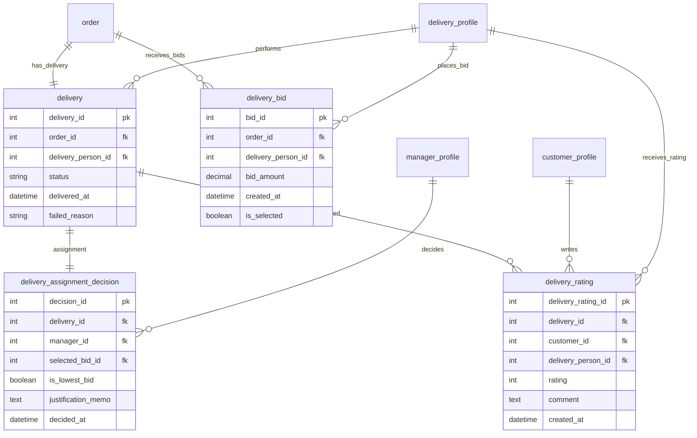

```mermaid
erDiagram

    %% delivery entity
    delivery {
        int delivery_id pk
        int order_id fk
        int delivery_person_id fk
        string status
        datetime delivered_at
        string failed_reason
    }

    %% delivery bidding
    delivery_bid {
        int bid_id pk
        int order_id fk
        int delivery_person_id fk
        decimal bid_amount
        datetime created_at
        boolean is_selected
    }

    %% manager assignment decision
    delivery_assignment_decision {
        int decision_id pk
        int delivery_id fk
        int manager_id fk
        int selected_bid_id fk
        boolean is_lowest_bid
        text justification_memo
        datetime decided_at
    }

    %% delivery rating
    delivery_rating {
        int delivery_rating_id pk
        int delivery_id fk
        int customer_id fk
        int delivery_person_id fk
        int rating
        text comment
        datetime created_at
    }

    %% relationships
    order ||--|| delivery : has_delivery
    delivery_profile ||--o{ delivery : performs

    order ||--o{ delivery_bid : receives_bids
    delivery_profile ||--o{ delivery_bid : places_bid

    delivery ||--|| delivery_assignment_decision : assignment
    manager_profile ||--o{ delivery_assignment_decision : decides

    delivery ||--o{ delivery_rating : rated
    customer_profile ||--o{ delivery_rating : writes
    delivery_profile ||--o{ delivery_rating : receives_rating
```