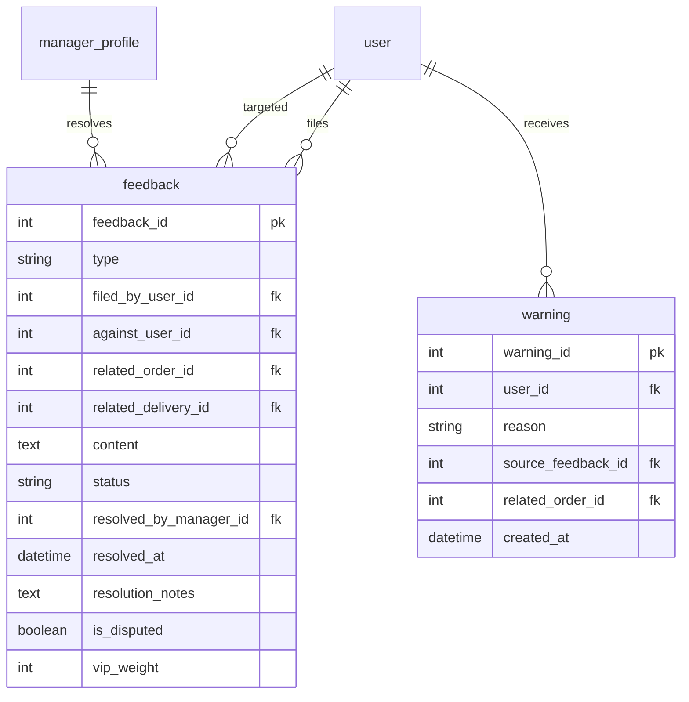

```mermaid
erDiagram

    %% complaints & compliments
    feedback {
        int feedback_id pk
        string type
        int filed_by_user_id fk
        int against_user_id fk
        int related_order_id fk
        int related_delivery_id fk
        text content
        string status
        int resolved_by_manager_id fk
        datetime resolved_at
        text resolution_notes
        boolean is_disputed
        int vip_weight
    }

    %% warnings issued to users
    warning {
        int warning_id pk
        int user_id fk
        string reason
        int source_feedback_id fk
        int related_order_id fk
        datetime created_at
    }

    %% relationships
    user ||--o{ feedback : files
    user ||--o{ feedback : targeted
    manager_profile ||--o{ feedback : resolves

    user ||--o{ warning : receives

```