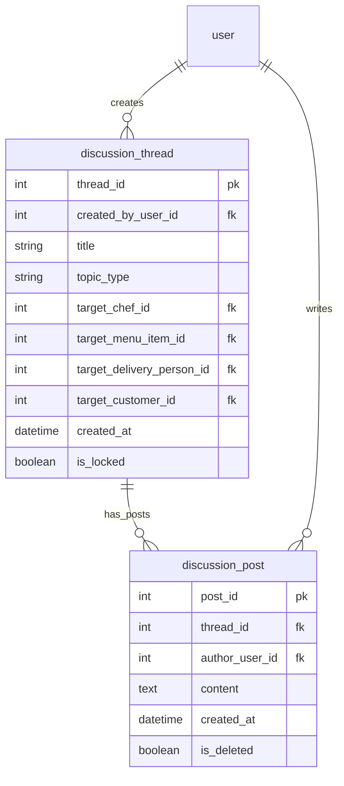

```mermaid
erDiagram

    %% discussion threads
    discussion_thread {
        int thread_id pk
        int created_by_user_id fk
        string title
        string topic_type
        int target_chef_id fk
        int target_menu_item_id fk
        int target_delivery_person_id fk
        int target_customer_id fk
        datetime created_at
        boolean is_locked
    }

    %% discussion posts
    discussion_post {
        int post_id pk
        int thread_id fk
        int author_user_id fk
        text content
        datetime created_at
        boolean is_deleted
    }

    %% relationships
    user ||--o{ discussion_thread : creates
    discussion_thread ||--o{ discussion_post : has_posts
    user ||--o{ discussion_post : writes
```