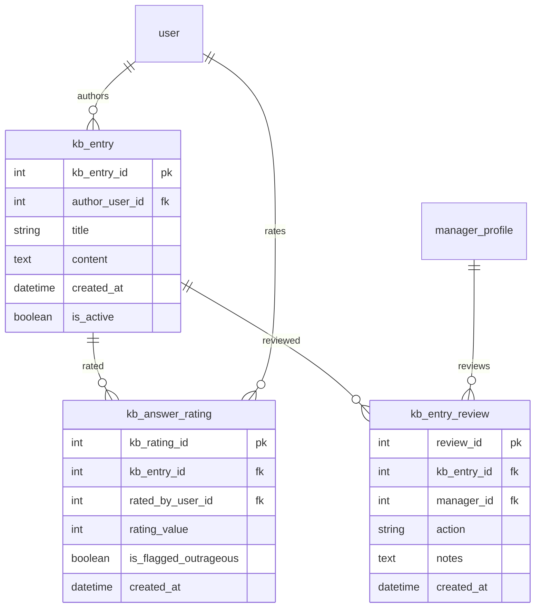

```mermaid
erDiagram

    %% knowledge base entries
    kb_entry {
        int kb_entry_id pk
        int author_user_id fk
        string title
        text content
        datetime created_at
        boolean is_active
    }

    %% user ratings of KB responses
    kb_answer_rating {
        int kb_rating_id pk
        int kb_entry_id fk
        int rated_by_user_id fk
        int rating_value
        boolean is_flagged_outrageous
        datetime created_at
    }

    %% manager reviews of flagged KB entries
    kb_entry_review {
        int review_id pk
        int kb_entry_id fk
        int manager_id fk
        string action
        text notes
        datetime created_at
    }

    %% relationships
    user ||--o{ kb_entry : authors
    kb_entry ||--o{ kb_answer_rating : rated
    user ||--o{ kb_answer_rating : rates
    kb_entry ||--o{ kb_entry_review : reviewed
    manager_profile ||--o{ kb_entry_review : reviews
```