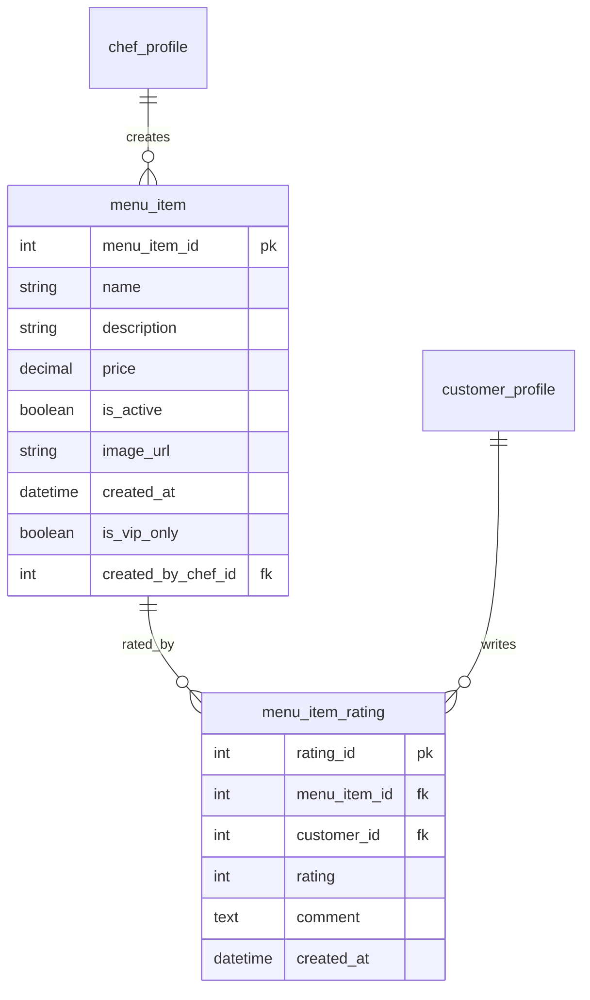

```mermaid
erDiagram

    %% menu items created by chefs
    menu_item {
        int menu_item_id pk
        string name
        string description
        decimal price
        boolean is_active
        string image_url
        datetime created_at
        boolean is_vip_only
        int created_by_chef_id fk
    }

    %% ratings for menu items
    menu_item_rating {
        int rating_id pk
        int menu_item_id fk
        int customer_id fk
        int rating
        text comment
        datetime created_at
    }

    %% relationships
    chef_profile ||--o{ menu_item : creates
    menu_item ||--o{ menu_item_rating : rated_by
    customer_profile ||--o{ menu_item_rating : writes
```