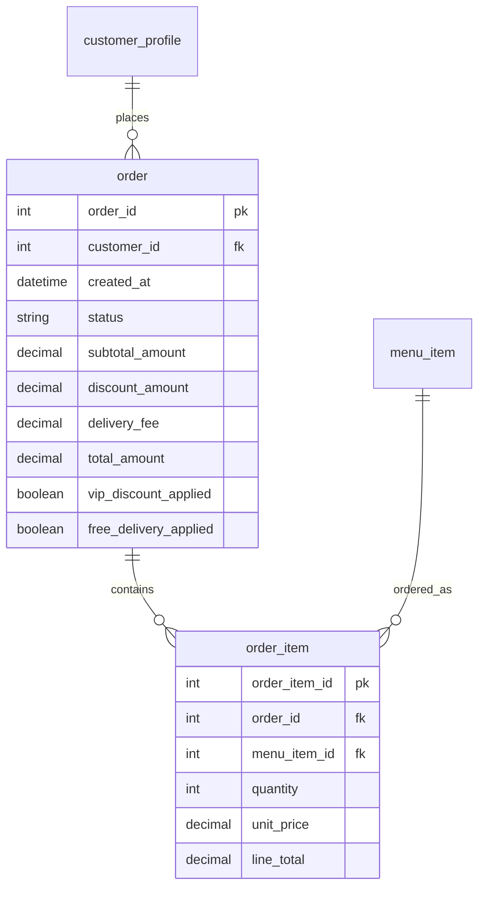

```mermaid
erDiagram

    %% order entity
    order {
        int order_id pk
        int customer_id fk
        datetime created_at
        string status
        decimal subtotal_amount
        decimal discount_amount
        decimal delivery_fee
        decimal total_amount
        boolean vip_discount_applied
        boolean free_delivery_applied
    }

    %% order items (many menu items per order)
    order_item {
        int order_item_id pk
        int order_id fk
        int menu_item_id fk
        int quantity
        decimal unit_price
        decimal line_total
    }

    %% relationships
    customer_profile ||--o{ order : places
    order ||--o{ order_item : contains
    menu_item ||--o{ order_item : ordered_as
```