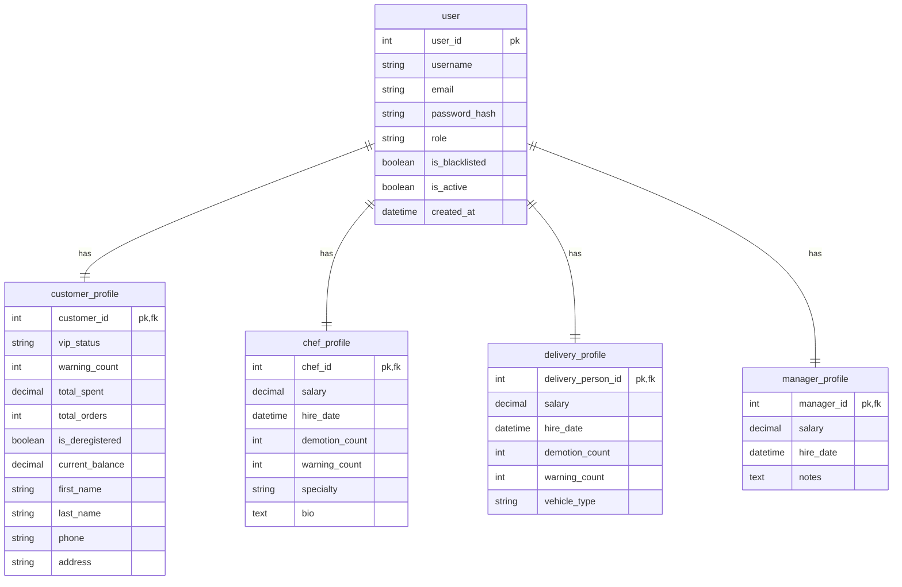

```mermaid
erDiagram
    %% base user account
    user {
        int user_id pk
        string username
        string email
        string password_hash
        string role
        boolean is_blacklisted
        boolean is_active
        datetime created_at
    }

    %% customer profile
    customer_profile {
        int customer_id pk,fk
        string vip_status
        int warning_count
        decimal total_spent
        int total_orders
        boolean is_deregistered
        decimal current_balance
        string first_name
        string last_name
        string phone
        string address
    }

    %% chef profile
    chef_profile {
        int chef_id pk,fk
        decimal salary
        datetime hire_date
        int demotion_count
        int warning_count
        string specialty
        text bio
    }

    %% delivery profile
    delivery_profile {
        int delivery_person_id pk,fk
        decimal salary
        datetime hire_date
        int demotion_count
        int warning_count
        string vehicle_type
    }

    %% manager profile
    manager_profile {
        int manager_id pk,fk
        decimal salary
        datetime hire_date
        text notes
    }

    %% role relationships
    user ||--|| customer_profile : has
    user ||--|| chef_profile : has
    user ||--|| delivery_profile : has
    user ||--|| manager_profile : has
```
