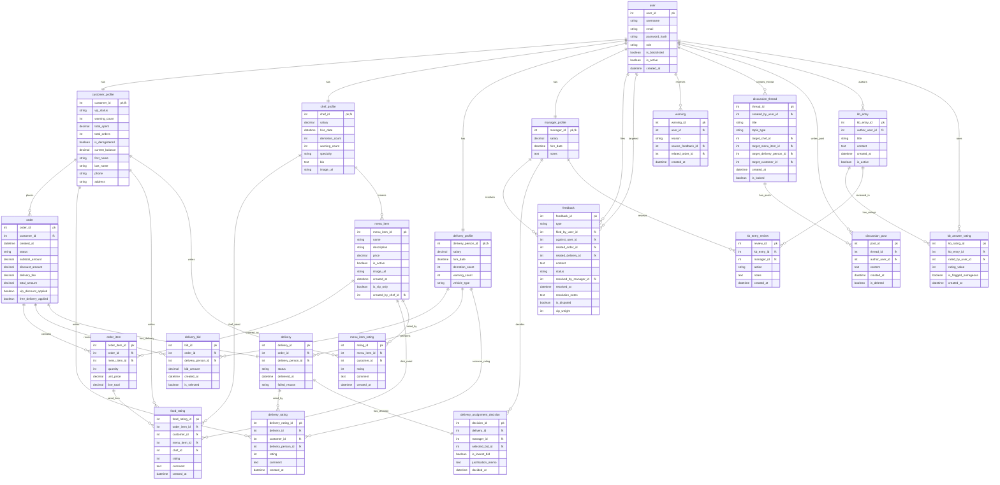

```mermaid
erDiagram
    %% base user account
    user {
        int user_id pk
        string username
        string email
        string password_hash
        string role
        boolean is_blacklisted
        boolean is_active
        
        datetime created_at
    }

    %% customer profile
    customer_profile {
        int customer_id pk,fk
        string vip_status
        int warning_count
        decimal total_spent
        int total_orders
        boolean is_deregistered
        decimal current_balance
        string first_name
        string last_name
        string phone
        string address
    }

    %% chef profile
    chef_profile {
        int chef_id pk,fk
        decimal salary
        datetime hire_date
        int demotion_count
        int warning_count
        string specialty
        text bio
        string image_url
    }

    %% delivery profile
    delivery_profile {
        int delivery_person_id pk,fk
        decimal salary
        datetime hire_date
        int demotion_count
        int warning_count
        string vehicle_type
    }

    %% manager profile
    manager_profile {
        int manager_id pk,fk
        decimal salary
        datetime hire_date
        text notes
    }

    %% relationships
    user ||--|| customer_profile : has
    user ||--|| chef_profile : has
    user ||--|| delivery_profile : has
    user ||--|| manager_profile : has

    %% menu items created by chefs
    menu_item {
        int menu_item_id pk
        string name
        string description
        decimal price
        boolean is_active
        string image_url
        datetime created_at
        boolean is_vip_only
        int created_by_chef_id fk
    }

    %% ratings for each menu item
    menu_item_rating {
        int rating_id pk
        int menu_item_id fk
        int customer_id fk
        int rating
        text comment
        datetime created_at
    }

    %% order entity
    order {
        int order_id pk
        int customer_id fk
        datetime created_at
        string status
        decimal subtotal_amount
        decimal discount_amount
        decimal delivery_fee
        decimal total_amount
        boolean vip_discount_applied
        boolean free_delivery_applied
    }

    %% order items (many menu items per order)
    order_item {
        int order_item_id pk
        int order_id fk
        int menu_item_id fk
        int quantity
        decimal unit_price
        decimal line_total
    }

    %% delivery bidding for orders
    delivery_bid {
        int bid_id pk
        int order_id fk
        int delivery_person_id fk
        decimal bid_amount
        datetime created_at
        boolean is_selected
    }

    %% relationships
    customer_profile ||--o{ order : places
    order ||--o{ order_item : contains
    menu_item ||--o{ order_item : ordered_as
    order ||--o{ delivery_bid : receives_bids
    delivery_profile ||--o{ delivery_bid : places_bid

    %% complaints & compliments
    feedback {
        int feedback_id pk
        string type
        int filed_by_user_id fk
        int against_user_id fk
        int related_order_id fk
        int related_delivery_id fk
        text content
        string status
        int resolved_by_manager_id fk
        datetime resolved_at
        text resolution_notes
        boolean is_disputed
        int vip_weight
    }

    warning {
        int warning_id pk
        int user_id fk
        string reason
        int source_feedback_id fk
        int related_order_id fk
        datetime created_at
    }

    %% relationships
    user ||--o{ feedback : files
    user ||--o{ feedback : targeted
    manager_profile ||--o{ feedback : resolves
    user ||--o{ warning : receives

    %% delivery entity
    delivery {
        int delivery_id pk
        int order_id fk
        int delivery_person_id fk
        string status
        datetime delivered_at
        string failed_reason
    }

    %% delivery assignment decision (manager selects bid)
    delivery_assignment_decision {
        int decision_id pk
        int delivery_id fk
        int manager_id fk
        int selected_bid_id fk
        boolean is_lowest_bid
        text justification_memo
        datetime decided_at
    }

    %% delivery rating (customer rates delivery person)
    delivery_rating {
        int delivery_rating_id pk
        int delivery_id fk
        int customer_id fk
        int delivery_person_id fk
        int rating
        text comment
        datetime created_at
    }

    %% food rating per order item
    food_rating {
        int food_rating_id pk
        int order_item_id fk
        int customer_id fk
        int menu_item_id fk
        int chef_id fk
        int rating
        text comment
        datetime created_at
    }

    %% relationships for new entities
    order ||--|| delivery : has_delivery
    delivery_profile ||--o{ delivery : performs
    delivery ||--o{ delivery_rating : rated_by
    customer_profile ||--o{ delivery_rating : writes
    delivery_profile ||--o{ delivery_rating : receives_rating

    delivery ||--|| delivery_assignment_decision : has_decision
    manager_profile ||--o{ delivery_assignment_decision : decides

    order_item ||--o{ food_rating : rated_item
    customer_profile ||--o{ food_rating : writes
    chef_profile ||--o{ food_rating : chef_rated
    menu_item ||--o{ food_rating : dish_rated

    %% discussion forum system
    discussion_thread {
        int thread_id pk
        int created_by_user_id fk
        string title
        string topic_type
        int target_chef_id fk
        int target_menu_item_id fk
        int target_delivery_person_id fk
        int target_customer_id fk
        datetime created_at
        boolean is_locked
    }

    discussion_post {
        int post_id pk
        int thread_id fk
        int author_user_id fk
        text content
        datetime created_at
        boolean is_deleted
    }

    %% relationships for discussion
    user ||--o{ discussion_thread : creates_thread
    discussion_thread ||--o{ discussion_post : has_posts
    user ||--o{ discussion_post : writes_post

    %% knowledge base system
    kb_entry {
        int kb_entry_id pk
        int author_user_id fk
        string title
        text content
        datetime created_at
        boolean is_active
    }

    kb_answer_rating {
        int kb_rating_id pk
        int kb_entry_id fk
        int rated_by_user_id fk
        int rating_value
        boolean is_flagged_outrageous
        datetime created_at
    }

    kb_entry_review {
        int review_id pk
        int kb_entry_id fk
        int manager_id fk
        string action
        text notes
        datetime created_at
    }

    %% relationships for KB system
    user ||--o{ kb_entry : authors
    kb_entry ||--o{ kb_answer_rating : has_ratings
    user ||--o{ kb_answer_rating : rates
    kb_entry ||--o{ kb_entry_review : reviewed_in
    manager_profile ||--o{ kb_entry_review : reviews

    %% chef to menu relationship
    chef_profile ||--o{ menu_item : creates
    menu_item ||--o{ menu_item_rating : rated_by
    customer_profile ||--o{ menu_item_rating : writes
```
